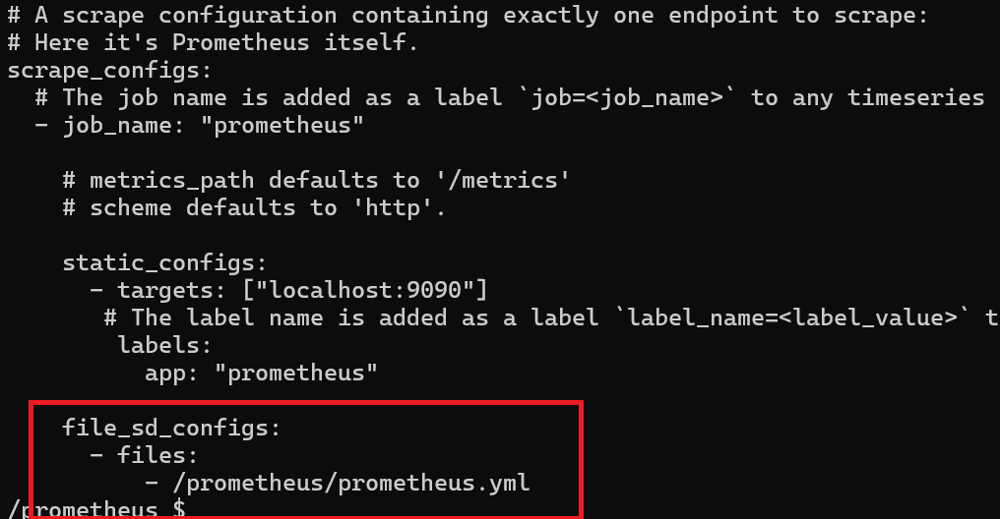
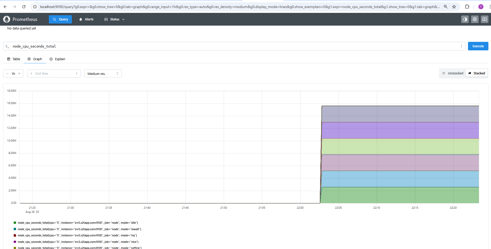

# Simple steps to implement prometheus

1. Run metric exporter in the target server ( Docker container )
```
docker run -d   --net="host"   --pid="host"   -v "/:/host:ro,rslave"   quay.io/prometheus/node-exporter:latest   --path.rootfs=/host
```
2. run Prometheus  container on monitoring server or ( in my case WSL )
** Note : you may create a volume for storing data **
   
```
docker volume create prometheus-data
# Start Prometheus container
docker run \
    -p 9090:9090 \
    -v /home/prometheus.yml:/etc/prometheus/prometheus.yml \
    -v prometheus-data:/prometheus \
    prom/prometheus
```
3. Modify prometheus.yml as below
   ```
      file_sd_configs:
      - files:
          - /prometheus/nodes.yml
   ```

Node list with  in nodes.yml

```
- targets: ["node:9100"]
  labels:
    job: "node"
   ```


## Result 

